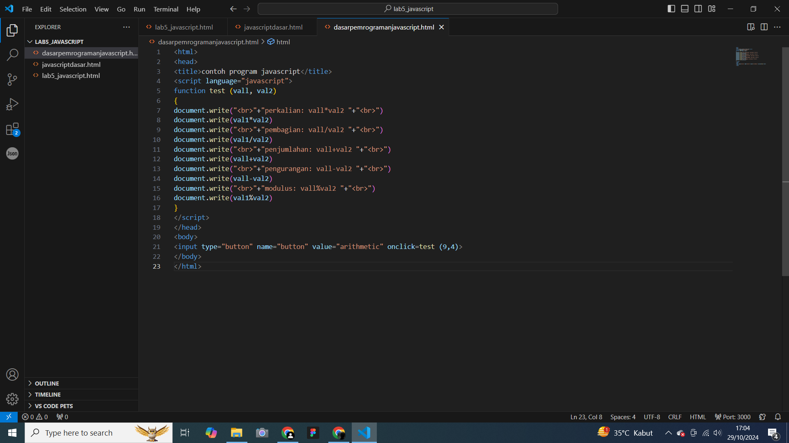

# lab5_javascript
## Nama  : Muhamad Ananda Putra Fraceda
## NIM   : 312310440
## Kelas : TI.23.A4
## 1. Membuat dokumen HTML dengan nama file lab5_javascript.html
- Gambar1
  
- Gambar2
  
## Javascript Dasar 
# Pemakaian Alert sebagai property window.
- Gambar1
  
_ Gambar2
  
# 3. Pemakaian method dalam objek
- Gambar1
  
- Gambar2
  
# 4. Pemakaian Prompt
- Gambar1
  
- Gambar2
- 
# 5. Pembuatan fungsi dan cara pemanggilannya
- Gambar1
  
- Gambar2
  
## Dasar Pemrograman Di Javascript 
# Operasi dasar aritmatika
- Gambar1
  
- Gambar2
  
# 7. Seleksi kondisi (if..else)
- Gambar1
  
- Gambar2
  
# 8. Penggunaan operator switch untuk seleksi kondisi
- Gambar1
  
- Gambar2
  
## Pembuatan Form
# Form Input
- Gambar1
  
- Gambar2
  
# 10. Form Button
- Gambar1
  
- Gambar2
  
## HTML DOM
# 11. Pilihan menggunakan checkBox dengan perhitungan otomatis
- Gambar1
  
- Gambar2
  
## Pembuatan Form Validasi
- Gambar1
  
- Gambar2
  
